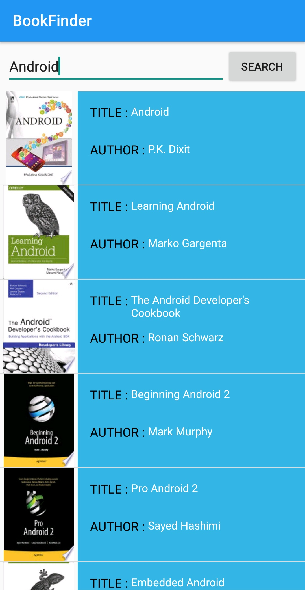
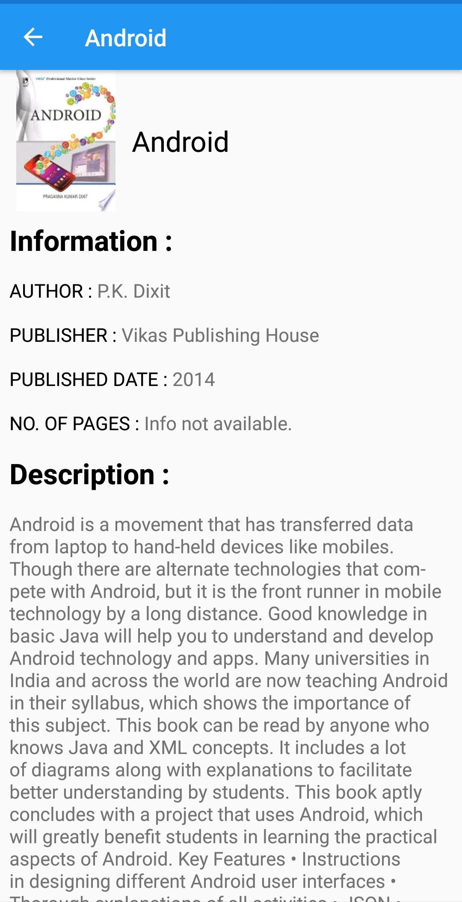

# BookFinder
This android application gets information on a book using the Google Books API.
# Technologies Used
Android Studio

Java

XML

# API Used:

Google Books API: https://developers.google.com/books/

# Screenshots

## Main

## Search Results Activity

## Book Description Activity

